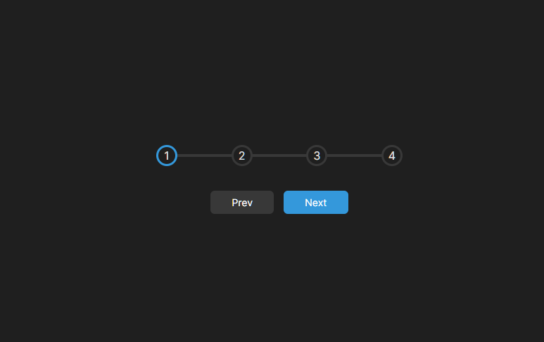
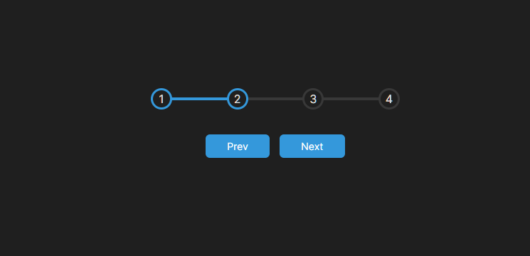

<h1 align="center"> Progress-Steps </h1>

  
  

## 🚀 Tecnologias

Esse projeto foi desenvolvido com as seguintes tecnologias:

- HTML
- CSS 
-JavaScript

## 💻 Projeto

feito por:

♥ Ricardo Antonio Rodrigues